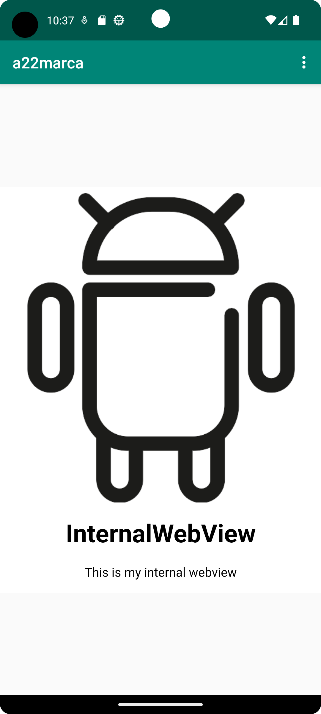

# Rapport

En WebView med ID:t `my_webview` implementerades i filen `activity_main.xml`. Detta gjorde det möjligt att skapa ett webview objekt i `MainActivity` som refererar till ID:et. Detta objekt instansieras i `onCreate` metoden och användes sedan i två olika metoder som öppnar en extern eller intern webview. Då en intern webview visas så användes en lokal html-fil som skapats i projektet och när en extern webview ska visas så används en webbsidas URL.

För att applikationen ska nå hemsidan på internet så implementerades en rad kod i `AndroidManifest.xml` som gör detta möjligt. Fortsättningsvis så tilläts även utförande av JavaScript på webbsidor genom att ändra inställningen för webview objektet i `MainActivity`.

Nedan visas raden som tillåter applikationen att använda internet.
```xml
    <uses-permission android:name="android.permission.INTERNET" />
```

Koden nedan visar hur webview objektet instansieras och tillåts utföra javascript på hemsidor.
```java
myWebView = findViewById(R.id.my_webview);
myWebView.getSettings().setJavaScriptEnabled(true);
```

Metoderna `showExternalWebPage` och `showInternalWebPage` används för att öppna en extern eller intern hemsida. 

```java
public void showExternalWebPage(){
    myWebView.loadUrl("https://www.his.se/");
}

public void showInternalWebPage(){
    myWebView.loadUrl("file:///android_asset/index.html");
}
```

De två nämnda metoderna ovan anropas beroende på vilken knapp användaren trycker på i applikationen. Denna selektion sker i metoden `onOptionsItemSelected`.

Filen som används för den interna webbsidan skapades och placerades i `assets` mappen av projektet, och den visar en bild och en text. Den externa webview tar användaren till www.his.se. På bilderna nedan visas hur dessa två webbsidor presenteras i applikationen.


Den interna hemsidan som används i applikationen.



Den externa webviewn tar användaren till www.his.se.


